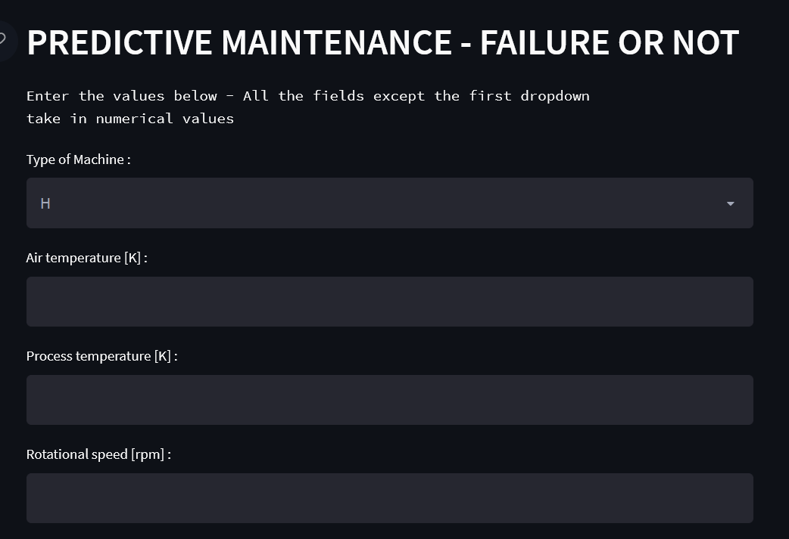
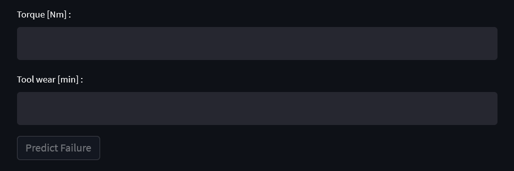

# PREDICTIVE MAINTENANCE

The project aims to predict if a particular hardware is in danger of failure or not.Examples of some features are Tool wear , Air Temperature , Rotational speed etc.

# WORKFLOW

### DATA COLLECTION

- Data was collected from Kaggle -

### DATA PREPROCESSING

- Initial data is processed for null values, correlations,outliers etc.
- Categorical values are handled to transform to numerical values.
- Standard scalar is used to normlize the data.

### MODEL BUILDING

- Multiple models like Support Vector Machines , XGBoost , Logistic Regression have been used. XGBoost has been found to be the best.
- Metrics like ROC/AUC have been used to come to the final metrics.

### DASHBOARD

- Streamlit was used to create the dashboard.

### DEPLOYMENT
- Streamlit was
- Model deployed to Google Cloud.(Link disabled due to recurring cost)

# TO RUN THE APP

- Create a virtual environment with python version >=3.7
- Activate the created environment
- pip install -r requirements.txt
- Run the below command on the terminal
    streamlit run main.py

# SCREENSHOT

  
  
